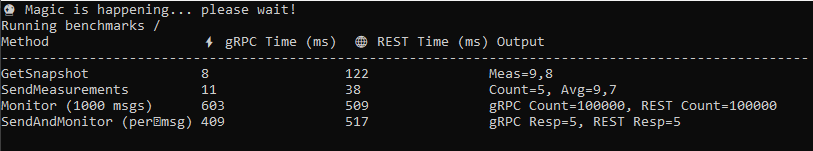

# 📊 gRPC vs REST Performance Benchmark

This repository contains a .NET application designed to **compare gRPC and REST APIs** across different communication patterns:

1. **Simple RPC** → `GetSnapshot`
2. **Client-streaming RPC** → `SendMeasurements`
3. **Server-streaming RPC** → `Monitor`
4. **Bidirectional streaming RPC** → `SendAndMonitor`

We implemented both **gRPC services** and **REST endpoints** with equivalent functionality, then measured latency and throughput on the client side.

---

## 🚀 What We Built

- **gRPC Service**
  - Defined with `.proto` contracts.
  - Implements all four RPC styles (unary, client-streaming, server-streaming, bidirectional).
  - Uses Protobuf serialization (binary, compact, efficient).

- **REST Service**
  - Implemented with ASP.NET Core minimal APIs.
  - Endpoints mirror gRPC methods:
    - `GET /snapshot/{partNumber}`
    - `POST /measurements`
    - `GET /monitor/{partNumber}` (server-streaming via NDJSON)
    - `POST /sendandmonitor` (bidirectional simulation via NDJSON)
  - Uses JSON serialization (text-based, human-readable).

- **Client Benchmark**
  - Measures **per-message latency** and **total throughput**.
  - Uses `Stopwatch` to compute elapsed times.
  - Displays results in a side-by-side table.

---

## 📊 Benchmark Results

### Example Output


---

## ⚡ Why gRPC is Faster

- **Binary Protobuf encoding** → smaller payloads, faster serialization/deserialization.
- **Multiplexed streams over HTTP/2** → efficient use of connections.
- **Lower CPU overhead** → especially noticeable with large payloads or high concurrency.
- **Consistent streaming semantics** → each message is delivered immediately.

---

## 🌐 Why REST Sometimes Appears Faster

- **Tiny payloads**: For very small messages (a few bytes), JSON parsing overhead is negligible, and gRPC’s framing overhead can dominate.
- **Flush behavior**: In our NDJSON implementation, REST flushes each line immediately, so per-message spacing looks smaller.
- **Measurement artifact**: Our stopwatch measured *client-side parsing time*. JSON line parsing with `StreamReader.ReadLineAsync()` is very cheap, while gRPC’s `ResponseStream.ReadAllAsync()` involves more async machinery.
- **Warm-up costs**: gRPC channel initialization adds overhead on the first call if not warmed up.

---

## 🧪 Lessons Learned

- **Per-message latency** can be misleading when payloads are tiny — REST may look “faster” because of parsing overhead.
- **Total throughput** (time to process thousands of messages) shows gRPC’s advantage clearly.
- **Payload size matters**: As messages grow larger, JSON serialization cost grows quickly, while Protobuf remains efficient.
- **Use NDJSON for REST streaming**: Without it, ASP.NET buffers `IAsyncEnumerable<T>` into a JSON array, which hides per-message latency.

---

## 🛠️ How to Run

### Option 1: Run with Visual Studio
1. Open the solution in **Visual Studio**.
2. Set **multiple startup projects**:
   - `GrpcService` → Start
   - `GrpcClient` → Start
3. Press **F5** (Run).  
   The gRPC server will start, then the console benchmark will run and display results.

### Option 2: Run from Command Line
1. Start the gRPC server:
   ```bash
   cd GrpcService
   dotnet run
2. Start the gRPC Client:
   ```bash
   cd GrpcClient
   dotnet run

---

## 📌 Conclusion

- gRPC consistently outperforms REST for **large payloads**, **high-throughput streaming**, and **cross-network scenarios**.  
- REST can appear faster in micro-benchmarks with **tiny payloads** due to client-side parsing overhead and flush behavior.  
- For **scalable, efficient, and real-time systems**, gRPC is the better choice.  
- For **simple, human-readable APIs**, REST remains valuable.  
- The right choice depends on your use case: **use gRPC when performance and streaming matter, use REST when simplicity and accessibility matter.**

---
